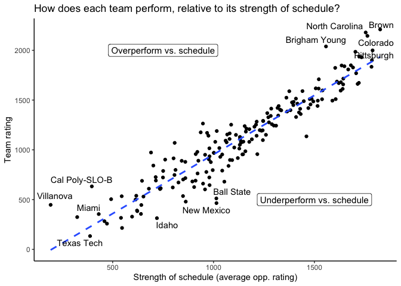
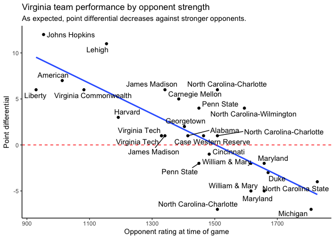
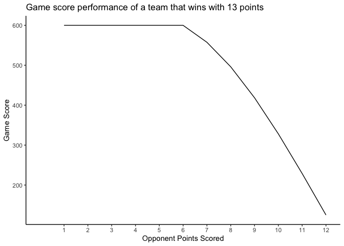

# fRisbee: For college ultimate frisbee

fRisbee is an R package designed to make interfacting with college
frisbee team rankings straightforward & easy.

Install the package using the code below.

``` r
devtools::install_github("https://github.com/bbwieland/fRisbee",
                         upgrade = "ask",
                         force = F)
library(fRisbee)
```

We can load the most up-to-date college rankings from
www.frisbee-rankings.com

``` r
head(fRisbee::GetFrisbeeRankings())
```

    ## # A tibble: 6 × 11
    ##    Rank RegionRank Team    Record WinPct Rating Region Conference Division   SoS
    ##   <dbl> <chr>      <chr>   <chr>   <dbl>  <dbl> <fct>  <chr>      <fct>    <dbl>
    ## 1     1 NE 1       Brown   38-2    0.95   2210. New E… Greater N… D-I      1826.
    ## 2     2 AC 1       North … 43-3    0.935  2179. Atlan… Carolina … D-I      1754.
    ## 3     3 SC 1       Colora… 30-2    0.938  2145. South… Rocky Mou… D-I      1763.
    ## 4     4 NW 1       Brigha… 22-1    0.957  2039. North… Big Sky DI D-I      1557.
    ## 5     5 OV 1       Pittsb… 25-9    0.735  1999. Ohio … West Penn… D-I      1788.
    ## 6     6 SW 1       Cal Po… 31-7    0.816  1986. South… SoCal DI   D-I      1703.
    ## # … with 1 more variable: PDC <dbl>

Using this data, lots of interesting analysis can be performed — for
example, this scatterplot of D-I strength of schedule vs. team rating:

(Note: you’ll need to install the ggrepel package to replicate this!)

``` r
library(ggrepel)

data = fRisbee::GetFrisbeeRankings(DivisionIOnly = T) %>%
  filter(Rating >= 0)
```

    ## Warning in ifelse(is.na(as.numeric(substr(Team, nchar(Team) - 1,
    ## nchar(Team)))), : NAs introduced by coercion

    ## Warning in mask$eval_all_mutate(quo): NAs introduced by coercion

``` r
ggplot(data,aes(x = SoS,
                y = Rating,
                label = Team)) +
  geom_point() +
  geom_smooth(method = "lm", se = F,linetype = "dashed") +
  geom_text_repel(max.overlaps = 8) +
  annotate("label",
           x = 750, 
           y = 2000, 
           label = "Overperform vs. schedule",
           size = 4) +
  annotate("label",
           x = 1500, 
           y = 500, 
           label = "Underperform vs. schedule",
           size = 4) +
  theme_classic() +
  labs(title = "How does each team perform, relative to its strength of schedule?",
       x = "Strength of schedule (average opp. rating)",
       y = "Team rating")
```

    ## `geom_smooth()` using formula 'y ~ x'

    ## Warning: ggrepel: 176 unlabeled data points (too many overlaps). Consider
    ## increasing max.overlaps

<!-- -->

Using fRisbee, it is also possible to scrape all of a team’s games
played in the season.

``` r
## scraping all Virginia games for the season

virginia = fRisbee::GetTeamResults("Virginia")

# Who were Virginia's ten toughest opponents this season, and how did they perform against them? 

virginia %>% 
  dplyr::arrange(OppRk) %>% 
  head(.,10)
```

    ## # A tibble: 10 × 21
    ##    OppRk Opponent Result Effect Status PctOfRanking Date       Event   Win   Pts
    ##    <dbl> <chr>    <chr>   <dbl> <fct>         <dbl> <date>     <chr> <dbl> <dbl>
    ##  1     2 North C… Loss …   0    Ignor…       0      2022-05-07 Atla…     0     2
    ##  2    14 North C… Loss …  -6.8  Counts       0.0503 2022-05-07 Atla…     0     8
    ##  3    16 Michigan Loss …  -7.59 Counts       0.0241 2022-02-12 Quee…     0     5
    ##  4    23 Duke     Loss …  -4.58 Counts       0.0282 2022-02-27 East…     0    11
    ##  5    25 Maryland Loss …  -2.45 Counts       0.0252 2022-02-13 Quee…     0    10
    ##  6    25 Maryland Loss … -16.4  Counts       0.0503 2022-05-08 Atla…     0    10
    ##  7    27 William… Loss … -10.2  Counts       0.0282 2022-02-26 East…     0    10
    ##  8    27 William… Loss …  -6.01 Counts       0.0448 2022-04-24 Virg…     0    11
    ##  9    30 North C… Win 1…  13.7  Counts       0.0245 2022-02-12 Quee…     1    11
    ## 10    41 North C… Loss … -14.7  Counts       0.0252 2022-02-13 Quee…     0     8
    ## # … with 11 more variables: OppPts <dbl>, GameScore <dbl>, PtDiff <dbl>,
    ## #   OpponentRating <dbl>, TeamRatingPostgame <dbl>, GameValue <dbl>,
    ## #   TeamRatingPregame <dbl>, GameValueUsed <dbl>, RatingsImpact <dbl>,
    ## #   Team <chr>, GameNum <int>

``` r
# How did Virginia's performance vary by opponent? 

ggplot(virginia %>% filter(Status == "Counts"),aes(x = OpponentRating, y = PtDiff,label = Opponent)) +
  geom_point() + 
  geom_smooth(method = "lm",
              se = F) +
  geom_hline(yintercept = 0,
             color = "red", 
             linetype = "dashed") +
  geom_text_repel(max.overlaps = Inf) +
  theme_classic() +
  labs(title = "Virginia team performance by opponent strength",
       subtitle = "As expected, point differential decreases against stronger opponents.",
       x = "Opponent rating at time of game",
       y = "Point differential")
```

    ## `geom_smooth()` using formula 'y ~ x'

<!-- -->

The USA Ultimate Frisbee website specifices an algorithm for determining
score for each game, developed such that the minimum gain in score for
any team is 125 points (after a one-goal win) and the maximum gain in
score for any team is 600 points (if they more than double their
opponent’s score). The GameScoreCalculator function computes the game
score for any given winner and loser scores.

``` r
# A close one-goal victory results in the minimum rating change of 125 points.
fRisbee::GameScoreCalculator(13,12)
```

    ## [1] 125

``` r
# A blowout results in the maximum rating change of 600 points.
fRisbee::GameScoreCalculator(13,3)
```

    ## [1] 600

``` r
# Let's look at how each possible outcome affects game score. 
# The x-axis displays potential opponent scores in a game won with 13 points.

seq = 12:1

scores = seq %>%
  map(~GameScoreCalculator(winner_score = 13, loser_score = .x)) %>%
  unlist()

plot_data = data.frame(opp_points = seq, 
                       score = scores)

ggplot(plot_data,aes(opp_points,score)) +
  scale_x_continuous(limits = c(0,12),
                     breaks = seq(1,12,1)) +
  geom_line() +
  theme_classic() +
  labs(x = "Opponent Points Scored",
       y = "Game Score",
       title = "Game score performance of a team that wins with 13 points")
```

<!-- -->

The ratings change produced by a specific game is a function of game
score AND the opponent’s rating coming into a game. Basically, if your
team’s game score exceeds the difference between your team’s rating and
your opponent’s rating, your rating will INCREASE as a result;
otherwise, it’ll DECREASE!

Yes — this means that wins don’t always result in ratings increases! You
need to beat a team by **more** than your “expected” win to see a
ratings increase; the inverse is also true: a weaker team that holds its
own against a strong team may see a ratings increase.

Use the RatingAdjustedGameScoreCalculator to determine how, given each
team’s initial rating and each team’s game performance, their final
rating will be affected by the outcome.

``` r
# In an evenly matched game, a close victory results in a ratings increase.
fRisbee::RatingAdjustedGameScoreCalculator(winner_rating = 1500,
                                           loser_rating = 1500,
                                           winner_score = 13, 
                                           loser_score = 12)
```

    ##     Team Initial GameScore Difference Increased
    ## 1 winner    1500      1625        125      TRUE
    ## 2  loser    1500      1375       -125     FALSE

``` r
# However, a highly-favored team winning a close game actually results in a ratings increase for the LOSING team.
fRisbee::RatingAdjustedGameScoreCalculator(winner_rating = 1500,
                                           loser_rating = 1000,
                                           winner_score = 13, 
                                           loser_score = 12)
```

    ##     Team Initial GameScore Difference Increased
    ## 1 winner    1500      1125       -375     FALSE
    ## 2  loser    1000      1375        375      TRUE

We can combine two functions, GetFrisbeeRankings and
RatingAdjustedGameScoreCalculator, to create a useful composite
function: RatingAdjustedGameScoreCalculatorTeam.

This works similary to RatingAdjustedGameScoreCalculator, but it takes
team names as inputs instead of ratings. The function automatically
pulls the most recent ratings for those teams, and calculates the game
score change accordingly.

``` r
fRisbee::RatingAdjustedGameScoreCalculatorTeam(winner_team = "Virginia",
                                               loser_team = "Virginia Tech",
                                               winner_score = 13, 
                                               loser_score = 8)
```

    ##            Name   Team Initial GameScore Difference Increased
    ## 1      Virginia winner 1514.83   1826.13   311.2996      TRUE
    ## 2 Virginia Tech  loser 1329.97   1018.67  -311.2996     FALSE

Data sourced from <https://www.frisbee-rankings.com/> — thanks to Cody
Mills for developing the rankings site! Ratings algorithm from the guide
at <https://play.usaultimate.org/teams/events/rankings/>
