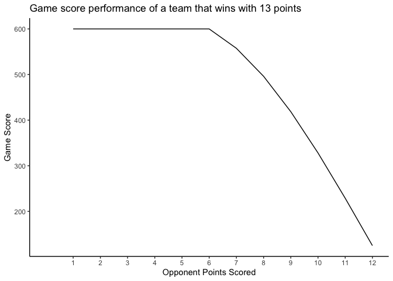

# fRisbee: For college ultimate frisbee

fRisbee is an R package designed to make interfacting with college
frisbee team rankings straightforward & easy.

Install the package using the code below.

    devtools::install_github("https://github.com/bbwieland/fRisbee",upgrade = "ask",force = T)
    library(fRisbee)

We can load the most up-to-date college rankings from
www.frisbee-rankings.com

    head(fRisbee::GetFrisbeeRankings())

    ## # A tibble: 6 × 11
    ##    Rank RegionRank Team    Record WinPct Rating Region Conference Division   SoS
    ##   <dbl> <chr>      <chr>   <chr>   <dbl>  <dbl> <fct>  <chr>      <fct>    <dbl>
    ## 1     1 NE 1       Brown   27-1    0.964  2224. New E… Greater N… D-I      1843.
    ## 2     2 AC 1       North … 30-3    0.909  2173. Atlan… Carolina … D-I      1789.
    ## 3     3 SC 1       Colora… 25-1    0.962  2138. South… Rocky Mou… D-I      1725.
    ## 4     4 NW 1       Brigha… 22-1    0.957  2064. North… Big Sky DI D-I      1582.
    ## 5     5 NE 2       Massac… 18-2    0.9    2053. New E… Greater N… D-I      1753.
    ## 6     6 NW 2       Washin… 11-0    1      2027. North… Cascadia … D-I      1634.
    ## # … with 1 more variable: PDC <dbl>

The USA Ultimate Frisbee website specifices an algorithm for determining
score for each game, developed such that the minimum gain in score for
any team is 125 points (after a one-goal win) and the maximum gain in
score for any team is 600 points (if they more than double their
opponent’s score). The GameScoreCalculator function computes the game
score for any given winner and loser scores.

    # A close one-goal victory results in the minimum rating change of 125 points.
    fRisbee::GameScoreCalculator(13,12)

    ## [1] 125

    # A blowout results in the maximum rating change of 600 points.
    fRisbee::GameScoreCalculator(13,3)

    ## [1] 600

    # Let's look at how each possible outcome affects game score. 
    # The x-axis displays potential opponent scores in a game won with 13 points.

    seq = 12:1

    scores = seq %>%
      map(~GameScoreCalculator(winner_score = 13, loser_score = .x)) %>%
      unlist()

    plot_data = data.frame(opp_points = seq, score = scores)

    ggplot(plot_data,aes(opp_points,score)) +
      scale_x_continuous(limits = c(0,12),breaks = seq(1,12,1)) +
      geom_line() +
      theme_classic() +
      labs(x = "Opponent Points Scored",
           y = "Game Score",
           title = "Game score performance of a team that wins with 13 points")

