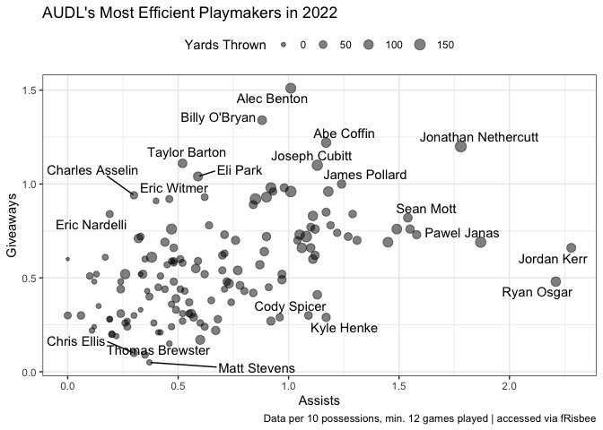

fRisbee: An Open-Source Package for College and Professional Ultimate
Frisbee Data and Modeling
================
Ben Wieland and Akiva Dienstfrey, University of Virginia
Aug 26, 2022

<!-- README.md is generated from README.Rmd. Please edit that file -->

## I. Introduction

The popularity of Ultimate Frisbee is skyrocketing: over 650 collegiate
men’s and women’s teams competed in the 2021-22 season, and the American
Ultimate Disc League continues to expand, with the addition of three new
franchises for the 2021-22 season \[@audlpopular\]. This increase in
popularity demands an increase in available data. `fRisbee` is an
open-source R package designed to create a fast and accessible way to
access collegiate and professional men’s and women’s Ultimate Frisbee
rankings, results, and historical data. The package provides ease of
access to previously inaccessible datasets, including access to
aggregated game-by-game information on over 5,400 Ultimate Frisbee
matches at the collegiate level during the 2021-22 season; it also
includes web scraping functions to access up-to-date results and data.

The package also makes Ultimate Frisbee predictive modeling simple: it
comes equipped with two pre-trained and easily deployable models for win
probability and margin of victory projections, and includes easy access
to the aforementioned historical data repositories for users to train
and fit their own models. This increased data access will provide
benefits at every level of the sports: fans will find it easier to
follow their favorite teams, coaches and players will have the tools at
their fingertips to make informed, data-driven decisions, and analysts
will find it easier to aggregate and evaluate statistics regarding the
sport.

`fRisbee` is currently in the process of submitting to CRAN. Once that
process is completed, the package will be installable using
`install.packages("fRisbee")`; however, the current version of the
package should be installed directly from its GitHub repository. Once
the package is installed, it can be loaded using `library(fRisbee)`.

``` r
# Run the below line if necessary:
# devtools::install_github("https://github.com/bbwieland/fRisbee")

library(fRisbee)
```

## II. Collegiate Data Access

Two of the most useful tools included in `fRisbee` are the
`load_rankings_men()` and `load_rankings_women()` functions. In tandem,
these functions provide a top-level overview of every team in college
frisbee. They include up-to-date biographical information, including
team division, conference, and region, as well as up-to-date information
on team performance, such as record, rating, and national ranking. The
functions are built around the frisbee-rankings website, developed by
Cody Mills \[@frisbeerankings\].

They also allow for filtering to include only Division I teams, as well
as a “simple table” format that includes only the most pertinent columns
for a true at-a-glance view of each team.

``` r
fRisbee::load_rankings_men() %>%
  str()
#> tibble [403 × 11] (S3: tbl_df/tbl/data.frame)
#>  $ Rank      : num [1:403] 1 2 3 4 5 6 7 8 9 10 ...
#>  $ RegionRank: chr [1:403] "NE 1" "AC 1" "SC 1" "NW 1" ...
#>  $ Team      : chr [1:403] "Brown" "North Carolina" "Colorado" "Brigham Young" ...
#>  $ Record    : chr [1:403] "38-2" "43-3" "30-2" "22-1" ...
#>  $ WinPct    : num [1:403] 0.95 0.935 0.938 0.957 0.735 ...
#>  $ Rating    : num [1:403] 2210 2179 2145 2039 1999 ...
#>  $ Region    : Factor w/ 11 levels "New England",..: 1 2 3 4 5 6 1 7 1 6 ...
#>  $ Conference: chr [1:403] "Greater New England DI" "Carolina DI" "Rocky Mountain DI" "Big Sky DI" ...
#>  $ Division  : Factor w/ 4 levels "D-I","D-III",..: 1 1 1 1 1 1 1 1 1 1 ...
#>  $ SoS       : num [1:403] 1826 1754 1763 1557 1788 ...
#>  $ PDC       : num [1:403] 384 425 382 482 211 ...
```

This data is useful for observing overall trends across collegiate
Ultimate Frisbee; given the dearth of media coverage provided to the
sport outside of a limited few publications, this accessibility makes
understanding the sport for those new to its format easier, while also
allowing for more in-depth analysis of trends at the team or conference
level by expert Ultimate Frisbee fans, players, and coaches.

Example: Team strength can vary greatly across conferences in college
athletics, due to disparities in program funding and appeal to incoming
high school recruits. Ultimate is no exception: the most competitive
conferences can have average team ratings that double those of the least
competitive conferences. fRisbee makes it easy to evaluate the strength
of each conference, utilizing the `load_rankings_men()` and
`load_rankings_women()` functions.

The example plot below showcases these differences, along with a few
other interesting idiosyncrasies. For example, North Carolina — the
top-ranked team last season — jumps off the page from the Carolina
conference. BYU was also the strongest program in the Big Sky conference
by far in 2022.

``` r
# These packages are necessary for the example below.
library(dplyr)
library(ggplot2)

# Use fRisbee to access up-to-date women's team rankings
teams = fRisbee::load_rankings_women(DivisionIOnly = T)


teams %>%
  # Calculate the median conference rating & the number of teams in each conference
  dplyr::group_by(Conference) %>%
  dplyr::mutate(AvgConfRating = median(Rating),
                TeamsInConf = n()) %>%
  dplyr::ungroup() %>%
  # Filter to include only conferences with 5 or more teams
  dplyr::filter(TeamsInConf >= 5) %>%
  # Create the boxplot display
  ggplot2::ggplot(aes(x = Rating, y = reorder(Conference, AvgConfRating))) +
  ggplot2::geom_boxplot() +
  # Add labeling and themes
  ggplot2::labs(x = "Team Ratings within Conference",
                y = "",
                title = "Visualizing Conference Strength in DI Women's Frisbee",
                subtitle = "Analysis limited to conferences with 5 or more team",
                caption = "Data: 2022 Frisbee-Rankings final ratings | accessed via fRisbee") +
  ggplot2::theme_bw()
```


Team-level collegiate data is also available within the `fRisbee`
package. The `load_team_results_men` and `load_team_results_women`
functions provide full information on every team result in the current
season, which is initially uploaded to USA Ultimate’s website \[@usau\].
They make it easy to visualize a team’s performance over the course of a
season at a glance, including raw data (the score for each team, the
game result, etc.) as well as additional informational data to
contextualize the matchup (the opposing team’s ranking, the event the
game was played at, etc.). Also included is information on the team’s
rating before and after the game was played, making it easy to tell if a
team outperformed expectations and saw a rating increase or
underperformed expectations and saw a rating decrease as a result of the
match.

``` r
fRisbee::load_team_results_men("Virginia") %>%
  str()
#> tibble [32 × 21] (S3: tbl_df/tbl/data.frame)
#>  $ OppRk             : num [1:32] 16 62 30 25 48 41 67 93 57 27 ...
#>  $ Opponent          : chr [1:32] "Michigan" "Carnegie Mellon" "North Carolina-Wilmington" "Maryland" ...
#>  $ Result            : chr [1:32] "Loss 5-12" "Win 11-6" "Win 11-7" "Loss 10-12" ...
#>  $ Effect            : num [1:32] -7.59 10.16 13.72 -2.45 1.92 ...
#>  $ Status            : Factor w/ 2 levels "Counts","Ignored": 1 1 1 1 1 1 1 1 1 1 ...
#>  $ PctOfRanking      : num [1:32] 0.0241 0.0238 0.0245 0.0252 0.0252 0.0252 0.0282 0.0282 0.0282 0.0282 ...
#>  $ Date              : Date[1:32], format: "2022-02-12" "2022-02-12" ...
#>  $ Event             : chr [1:32] "Queen City Tune Up 2022" "Queen City Tune Up 2022" "Queen City Tune Up 2022" "Queen City Tune Up 2022" ...
#>  $ Win               : num [1:32] 0 1 1 0 1 0 1 1 1 0 ...
#>  $ Pts               : num [1:32] 5 11 11 10 13 8 15 15 14 10 ...
#>  $ OppPts            : num [1:32] 12 6 7 12 12 15 9 12 13 15 ...
#>  $ GameScore         : num [1:32] -600 547 467 -238 125 ...
#>  $ PtDiff            : num [1:32] -7 5 4 -2 1 -7 6 3 1 -5 ...
#>  $ OpponentRating    : num [1:32] 1808 1385 1595 1658 1464 ...
#>  $ TeamRatingPostgame: num [1:32] 1522 1505 1501 1517 1513 ...
#>  $ GameValue         : num [1:32] 1208 1932 2062 1420 1589 ...
#>  $ TeamRatingPregame : num [1:32] 1530 1495 1487 1520 1511 ...
#>  $ GameValueUsed     : num [1:32] 1208 1932 2062 1420 1589 ...
#>  $ RatingsImpact     : num [1:32] 29.1 46 50.5 35.8 40.1 ...
#>  $ Team              : chr [1:32] "Virginia" "Virginia" "Virginia" "Virginia" ...
#>  $ GameNum           : int [1:32] 1 2 3 4 5 6 7 8 9 10 ...
```

These data are useful from a variety of perspectives. For fans, it can
be interesting to follow a team’s ups, downs, and general performance at
various points throughout the season.

## III. Historical Collegiate Data

One key issue with publicly available collegiate Ultimate Frisbee data
is the inaccessibility of results, rankings, and standings from previous
seasons. While individual tournament results can sometimes be cobbled
together from a variety of tournament websites and social media posts,
there is no collective source for viewing past results in a structured
and organized way.

`fRisbee` aims to change that, beginning with data from the 2021-22
season. In addition to functionality for scraping up-to-date current
results, the package will also contain information on past results. By
periodically performing in-season web scrapes and saving the data to an
outside database, `fRisbee` can be instrumental in documenting the
history of college Ultimate Frisbee over time.

The historical data currently available within the package is very
limited in scope, including only games between top 100 teams during the
2021-22 season. This data is accessible directly via the `fRisbee`
package as two dataframes: `gamesM` and `gamesW`. The data is
game-level, and stored in the same format as the output from the
`load_team_results_` family of functions.

In the future, data will be collected and stored on all games (not just
those between top-100 foes) and made accessible through the package in a
style similar to `nflreadr` \[@nflreadr\].

``` r
fRisbee::gamesW %>%
  head(3)
#> # A tibble: 3 × 21
#>   OppRk Opponent  Result Effect Status PctOfRanking Date       Event   Win   Pts
#>   <dbl> <chr>     <chr>   <dbl> <fct>         <dbl> <date>     <chr> <dbl> <dbl>
#> 1    12 Brigham … Win 1…   2.35 Counts       0.0347 2022-02-12 Quee…     1    11
#> 2    49 Columbia  Win 1…   0    Ignor…       0      2022-02-12 Quee…     1    12
#> 3    34 Michigan  Win 1…   0    Ignor…       0      2022-02-12 Quee…     1    11
#> # … with 11 more variables: OppPts <dbl>, GameScore <dbl>, PtDiff <dbl>,
#> #   OpponentRating <dbl>, TeamRatingPostgame <dbl>, GameValue <dbl>,
#> #   TeamRatingPregame <dbl>, GameValueUsed <dbl>, RatingsImpact <dbl>,
#> #   Team <chr>, GameNum <int>
```

## IV. USA Ultimate Algorithm Implementation

College Ultimate Frisbee is unique among collegiate sports in its
utilization of an algorithm alone to determine postseason bids. While
major sports such as football and basketball have selection committees
for the College Football Playoff and March Madness, respectively,
wild-card bid allocation for the USAU College Championships is conducted
solely based on the ‘USAU Ultimate Rankings’ \[@usaurankings\].

The team ratings are the average of a team’s game ratings. Each game
rating is a function of the opponent’s rating in that game, as well as
the team’s performance in the game.

The formula for computing team performance rating for a given game is as
follows.

First, a score difference proportion

is computed.


Then, that value is passed into a formula for calculating the
performance rating:

 * 0.4\pi)}{sin(0.4\pi)}")

This formula is designed for a few specific properties: every one-goal
game has a value of 125, goal differences are “worth” more rating points
in close games than blowouts, and the maximum possible performance
rating is 600, which can be obtained only in games where a team doubles
their opponent’s score.

To calculate a final game rating, that performance rating is added to
the opponent’s pregame rating.


A team’s season-long rating is calculated as a weighted average of their
game ratings, designed to prioritize recent games and remove the impact
of games with extreme differences in competition.

This algorithm proves useful for teams to know exactly how well they
need to play to earn a wild-card bid to the college championships, and
requires them to play at a high level even in games against weaker
competition; a win does not guarantee a rating increase! However, its
complexity makes it difficult to use on the fly; the last thing a coach
wants to be doing mid-tournament is computing trigonometric functions on
the sideline. The `calculate_` family of functions within `fRisbee`
makes these calculations easy and accessible, and can be easily
implemented via Shiny app or another interface for quick use. There are
three key functions within the family, each designed for a different use
case:

1.  `calculate_game_score` calculates the performance rating for a
    winning team, given the winning and losing score:

``` r
calculate_game_score(15,11)
#> [1] 381.1648
```

2.  `calculate_game_score_adjusted` takes as arguments not just the
    winning and losing scores, but also the initial ratings of the
    winning and losing teams. From this, it calculates the final rating
    impact of a game in the `Difference` column; this column is a sum of
    the `Initial` column (the opponent rating) and the `GameScore`
    column (the performance rating). In the below example, the winning
    team wins a close game 15-14 despite entering the game as a heavy
    800 rating point favorite. As a result, the winning team actually
    experiences a decrease in their overall rating due to the outcome;
    this is an important quirk of the USAU formula that differentiates
    it from standard Elo ratings, where a team’s rating never decreases
    with a win or increases with a loss.

``` r
calculate_game_score_adjusted(1800,1000,15,14)
#>     Team Initial GameScore Difference Increased
#> 1 winner    1800      1125       -675     FALSE
#> 2  loser    1000      1675        675      TRUE
```

3.  `calculate_game_score_adjusted_team` is similar in structure to
    `calculate_game_score_adjusted`, with one useful caveat: instead of
    taking the ratings of the winning and losing teams as inputs, it
    simply takes the names of the winning and losing teams, as well as
    the league type (“mens” or “womens”). Then, it automatically pulls
    the current rating of those teams using the `load_rankings_`
    function family. This function is great for answering hypothetical
    matchup questions; the example answers the question “What would
    happen to each team’s rating if North Carolina’s men’s team beat
    Brown’s men’s team 13-11?”

``` r
fRisbee::calculate_game_score_adjusted_team("North Carolina","Brown",13,11,"mens")
#>             Name   Team Initial GameScore Difference Increased
#> 1 North Carolina winner 2179.26   2438.63   259.3704      TRUE
#> 2          Brown  loser 2209.79   1950.42  -259.3704     FALSE
```

One more function is included in the `calculate_` family, though its
functionality is slightly different from the other three:
`calculate_win_probability`. This function uses pre-trained logistic
regression models within the package to calculate the win probability of
a hypothetical game between Team A and Team B, given each team’s rating
and the league type of the game. The example below computes the win
probability for a game between a 1500-rated women’s team and a
1300-rated women’s team.

``` r
fRisbee::calculate_win_probability(1500,1300,"womens")
#> [1] 0.7219515
```

## V. American Ultimate Disc League Data

Ultimate is also popular at the semi-professional level, by way of the
American Ultimate Disc League. The AUDL plays under a ruleset that
differs from USA Ultimate, the administrators of college Ultimate: AUDL
fields are larger, have a shorter stall clock (essentially a shot clock
for time to throw the disc), and are officiated by referees instead of
self-officiated, along with many other differences \[@rules\]. However,
the fundamental rules and structure of the sport remain the same, and
similar data are collected for games played under AUDL and USAU rules.

AUDL data is also accessible via the `fRisbee` package. Three functions
are included in the `load_audl_` family for scraping game-level,
team-level, and player-level data. In addition, a glossary of AUDL team
information such as cities, abbreviations, and logos are made available
via the `glossary_AUDL_teams` dataframe. This glossary is particularly
useful for data visualization, where team logos can be added to plots to
enhance graphics.

1.  `load_audl_games` provides game-level data on AUDL matchups. In
    addition to the actual game results, other useful information about
    each game is included in these observations, such as the week the
    game was played, whether the game was a postseason matchup or not,
    the stadium where the game was played, and the date and time of the
    game. The game’s streaming URL is also provided in the
    `streamingURL` column, where subscribers to AUDL TV can either watch
    a game live or view a game replay.

In the example below, `load_audl_games` is used to quickly summarise
information about home-field advantage in the AUDL. In the 2022 season,
home teams outscored away teams by approximately 1.21 points per game on
average.

``` r
games = fRisbee::load_audl_games(2022)

# Does home-field advantage exist in the AUDL?

games %>%
  # filter to regular season only
  dplyr::filter(substr(week,1,4) == "week") %>%
  # calculating average home & away scores
  dplyr::summarise(avgHome = mean(homeScore),
                   avgAway = mean(awayScore))
#>    avgHome  avgAway
#> 1 21.57333 20.36667
```

2.  `load_audl_player_stats` provides player-level statistics for each
    season of AUDL play. These statistics include both basic information
    — goals, assists, blocks, etc. — and more complex statistics such as
    offensive efficiency. Statistics can be requested either as
    season-long totals, per-game averages, or per-10-possession or
    per-10-points statistics. Each set of statistics is useful for
    different purposes: the total and per-game statistics are useful
    descriptors for ranking players, while the per-point and
    per-possession statistics sacrifice a bit of fungibility to offer a
    tempo-free and pace-free number that is perhaps more accurate for
    player evaluation.

In the example below, per-10-possession data is used to evalute the most
efficient playmakers in Ultimate for the 2022 season. Ideally, a good
playmaker will create assists at a high rate while infrequently turning
the disc over. In this regard, Jordan Kerr and Ryan Osgar stand out from
the rest of the pack.

``` r
library(ggrepel)

player_stats = fRisbee::load_audl_player_stats(2022, stat_type = "10 possessions") 

player_stats_plot = player_stats %>%
  # filtering to players who played in all games
  dplyr::filter(gamesPlayed >= 12) %>%
  # creating a composite "giveaways" stat
  dplyr::mutate(giveaways = throwaways + stalls + drops)

ggplot2::ggplot(player_stats_plot,aes(x = assists, y = giveaways)) +
  # adding points
  ggplot2::geom_point(aes(size = yardsThrown), alpha = 0.5) +
  # adding readable text labels via ggrepel
  ggrepel::geom_text_repel(aes(label = name)) +
  # re-sizing scale of point size
  ggplot2::scale_size_continuous(range = c(1,4)) +
  ggplot2::theme_bw() +
  ggplot2::labs(x = "Assists", y = "Giveaways",
                size = "Yards Thrown",
                title = "AUDL's Most Efficient Playmakers in 2022",
                caption = "Data per 10 possessions, min. 12 games played | accessed via fRisbee") +
  ggplot2::theme(legend.position = "top")
```



3.  `load_audl_team_stats` provides access to team-level AUDL statistics
    by season. Like its sibling function for player-level statistics,
    `load_audl_team_stats` offers functionality for both total and
    per-game statistics. It also adds a `team_type` option, which allows
    for either team or opponent stats to be accessed:
    `team_type = "team"` will yield points scored, assists recorded,
    etc. while `team_type = "opponent"` will yield points allowed,
    assists allowed, etc.

In the example below, `load_audl_team_stats` is utilized in conjunction
with the `glossary_AUDL_teams` dataframe included in the package. First,
team data from 2022 are accessed and a variable for net rating is
created using the formula ‘points scored - points allowed’. Then, the
glossary including team logos is joined to the team dataset. Finally,
the net ratings are plotted in bar chart format and the `ggimage`
package is used to plot images of each team’s logo at the end of their
bar. This chart is just one example of how team logos can be seamlessly
implemented into visualizations in R using the `glossary_AUDL_teams`
dataframe.

``` r
library(ggimage)

# scraping stats and creating net rating
team_stats = fRisbee::load_audl_team_stats(2022) %>%
  dplyr::mutate(netRating = scoresFor - scoresAgainst)

# joining the glossary of logos
team_stats_plot = team_stats %>%
  dplyr::left_join(glossary_AUDL_teams, by = "teamName")

ggplot2::ggplot(team_stats_plot, aes(x = netRating, y= reorder(teamName, netRating))) +
  # creating bars
  ggplot2::geom_col(fill = "black", width = 0.3) +
  # adding logos
  ggimage::geom_image(aes(image = logoURL)) +
  # creating the anchor line in the middle
  ggplot2::geom_vline(xintercept = 0) +
  ggplot2::labs(x = "Net Rating", y = "Team",
       title = "AUDL Net Ratings - 2022 Season",
       caption = "Data from 2022 season | accessed via fRisbee") +
  ggplot2::theme_bw()
```


## VI. Bibliography
