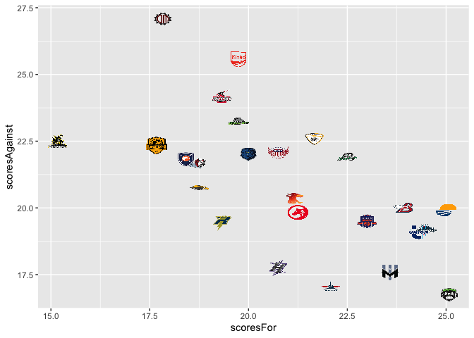

<!-- README.md is generated from README.Rmd. Please edit that file -->

# fRisbee

<!-- badges: start -->
<!-- badges: end -->

The goal of fRisbee is to …

## Installation

You can install the released version of fRisbee from
[CRAN](https://CRAN.R-project.org) with:

``` r
install.packages("fRisbee")
```

And the development version from [GitHub](https://github.com/) with:

``` r
# install.packages("devtools")
devtools::install_github("bbwieland/fRisbee")
```

## Example: Evaluating AUDL team performance

This is a basic example which shows you how to solve a common problem:

``` r
library(fRisbee)

team_stats = fRisbee::load_audl_team_stats(season = 2022, stat_type = "game")
str(team_stats)
#> 'data.frame':    25 obs. of  14 variables:
#>  $ teamID         : chr  "empire" "flyers" "summit" "union" ...
#>  $ teamName       : chr  "Empire" "Flyers" "Summit" "Union" ...
#>  $ gamesPlayed    : int  12 12 12 12 13 13 13 12 13 12 ...
#>  $ wins           : num  1 0.92 0.92 0.92 0.85 0.85 0.77 0.75 0.69 0.67 ...
#>  $ losses         : num  0 0.08 0.08 0.08 0.15 0.15 0.23 0.25 0.31 0.33 ...
#>  $ scoresFor      : num  25.1 22.1 24.5 24.3 23.9 ...
#>  $ scoresAgainst  : num  16.8 17.1 19.2 19.1 19.9 ...
#>  $ completions    : num  262 259 246 246 270 ...
#>  $ turnovers      : num  13.5 13.7 15.2 15.8 13.7 ...
#>  $ blocks         : num  11.5 9.33 11.17 9.58 10.15 ...
#>  $ holds          : num  15 15.5 16 16.3 16.5 ...
#>  $ breaks         : num  9.92 6.42 8.5 8 7.15 8.77 9.15 8.08 5.15 6.92 ...
#>  $ huckCompletions: num  7.42 8.58 10.17 7.33 6.31 ...
#>  $ huckTurnovers  : num  3.25 4.75 5 3.42 3.77 4.46 4.62 4.83 3.31 2.83 ...
```

``` r
library(dplyr)
#> 
#> Attaching package: 'dplyr'
#> The following objects are masked from 'package:stats':
#> 
#>     filter, lag
#> The following objects are masked from 'package:base':
#> 
#>     intersect, setdiff, setequal, union

# creating a 'net rating' variable:

team_stats = team_stats %>%
  dplyr::mutate(netRating = scoresFor - scoresAgainst)

# attaching the dataframe of team logos, glossary_AUDL_teams

team_stats = team_stats %>%
  dplyr::left_join(fRisbee::glossary_AUDL_teams, by = "teamName")
```

``` r
library(ggplot2)

ggplot2::ggplot(team_stats, aes(x = netRating, y= reorder(teamName, netRating))) +
  geom_col() +
  labs(x = "Net Rating", y = "Team",
       title = "AUDL Net Ratings - 2022 Season") +
  theme_bw()
```


``` r
library(ggimage)
#> Bioconductor version '3.12' is out-of-date; the current release version '3.15'
#>   is available with R version '4.2'; see https://bioconductor.org/install

ggplot2::ggplot(team_stats, aes(x = scoresFor, y = scoresAgainst)) +
  geom_image(aes(image = logoURL)) 
```


